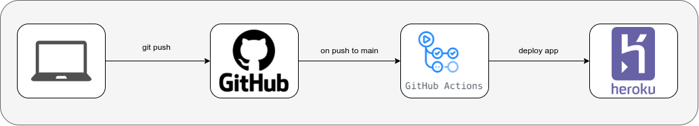

# Continuous integration/Continuous Deployment (CI/CD)

Current repository has activated GitHub actions: 



On every push to the repository `main` branch, the workflow is executed and the application is deployed in Heroku.

## GitHub repository needed secrets

Following secrets are needed to be created in order that workflow could be successfully executed:

- `API_USERNAME`: username that will be used to access REST API
- `API_PASSWORD`: password of the username that will be used to access REST API
- `DB_URL`: database URL, it must have this format: `postgresql://<host>:<port>/<db_name>?user=<username>&password=<password>`
- `DB_USERNAME`: database user
- `DB_PASSWORD`: database password
- `DOCKERHUB_TOKEN`: DockerHub token
- `DOCKERHUB_USERNAME`: DockerHub username
- `HEROKU_API_KEY`: Heroku API key
- `HEROKU_APP_NAME`: Heroku application name

## GitHub actions workflow

[push-main.yml](../../.github/workflows/push-main.yml) workflow is executed in every push on `main` branchwith these steps:


1. **Run tests and build app**: execute unitary and integration tests, if they are successfull, then the application is built and uploaded for following steps.
2. **Publish and deploy in Heroku**: download the built application, build the Heroku container and deploy it in Heroku
3. **Publish in DockerHub**: download the build application, build the Docker image and publish it in [DockerHub repository](https://hub.docker.com/repository/docker/drojo/twitter-scheduler-tfm).
4. **Smoke tests**:  verify that the deployed application in Heroku answer to `/health` endpoint with 200 and that the response is that the STATUS is UP.

## Heroku configuration

Is needed to create an application in Heroku and adding as resource a Heroku Postgres database, also is needed to create these **Config Vars**:

- `API_USERNAME`: user for REST API and OpenApi access.
- `API_PASSWORD`: password for REST API and OpenApi user.
- `DB_URL`: database URL, it must have this format: `postgresql://<host>:<port>/<db_name>?user=<username>&password=<password>`
- `DB_USERNAME`: database user
- `DB_PASSWORD`: database password
- `TWITTER_ACCESS_TOKEN`: Twitter API access token. It must be created with **Read, Write, and Direct Messages permissions**.
- `TWITTER_ACCESS_TOKEN_SECRET`: Twitter API access token secret
- `TWITTER_CONSUMER_KEY`: Twitter API consumer key
- `TWITTER_CONSUMER_SECRET`: Twitter API consumer secret

> **_NOTE:_** DATABASE_URL is created by default when Heroku Postgres database is created but their format is not valid for the application, so DB_URL is needed

## Available endpoints

Application root path: [https://twitter-scheduler-tfm.herokuapp.com/](https://twitter-scheduler-tfm.herokuapp.com/)

- `/`: welcome message
- `/openapi.html`: OpenAPI documentation
- `/togglz`: feature toggles management
- `/actuator`: actuator endpoints available
```
{
    "_links":{
        "self":{
            "href":"https://twitter-scheduler-tfm.herokuapp.com/actuator",
            "templated":false
        },
        "health":{
            "href":"https://twitter-scheduler-tfm.herokuapp.com/actuator/health",
            "templated":false
        },
        "health-path":{
            "href":"https://twitter-scheduler-tfm.herokuapp.com/actuator/health/{*path}",
            "templated":true
        },
        "info":{
            "href":"https://twitter-scheduler-tfm.herokuapp.com/actuator/info",
            "templated":false
        },
        "togglz-name":{
            "href":"https://twitter-scheduler-tfm.herokuapp.com/actuator/togglz/{name}",
            "templated":true
        },
        "togglz":{
            "href":"https://twitter-scheduler-tfm.herokuapp.com/actuator/togglz",
            "templated":false
        }
    }
}
```
- `/actuator/info`: application information, here can be checked that `main` is the deployed branch as it is required by Trunk-based development.

```
{
    "git":{
        "branch":"main",
        "commit":{
            "id":"752a6d4",
            "time":"2021-12-06T11:53:04Z"
        }
    },
    "build":{
        "artifact":"twitter-scheduler",
        "name":"twitter-scheduler",
        "time":"2021-12-06T11:55:13.320Z",
        "version":"0.0.1-SNAPSHOT",
        "group":"com.mastercloudapps"
    }
}
```
- `/actuator/health`: welcome message
```
{
    "status":"UP"
}
```
- `/actuator/togglz`: feature toggles status:
```
[
    {
        "name":"SCHEDULER",
        "enabled":true,
        "strategy":null,
        "params":{}
    }
]
```