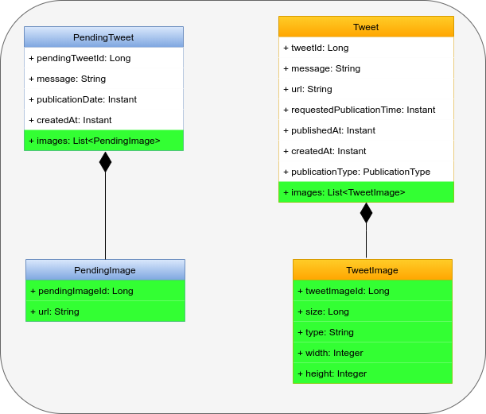
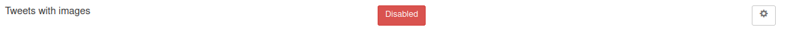

# Feature: tweets with images

- [Feature requisites](#feature-requisites)
- [How feature is implemented](#how-feature-is-implemented)
- [Implementation steps](#implementation-steps)
- [Commits](#commits)

---

## Feature requisites

Is requested to provide the possibility of the tweets that is going to be published, they can have as additional content one or more images.

Is needed to provide the url where the image is available

## How feature is implemented

In order to complete this feature, is needed to modify the **domain** of the application, adding two new entities to Pending Tweet and Tweet agreggate roots:



This also changes the **database** adding two new tables: PENDING_IMAGE and TWEET_IMAGE, both with a foreign key related to PENDING_TWEET and TWEET respectively:


Control of the feature toggle is done in following parts:

- **PublisherService.buildPublishTweetRequest(PendingTweet pendingTweet)**: when a tweet is going to be published. Called when a tweet is going to be published using Scheduled task and also when it is published on demand.
- **CreatePendingTweetRequestMapper.mapRequest(final PendingTweetRequest request)**: when a request to create a pending tweet is received
- **PendingTweetResponseMapper.mapResponse(PendingTweet pendingTweet)**: when a pending tweet response is built. Called in the response when a pending tweet is created, when it is searched by ID and when all pending tweets are requested. 
- **TweetResponseMapper.mapResponse(Tweet tweet)**: when a tweet response is built. Called from getTweets and getTweetById

Example of pending tweet creation request with images:

```
{
  "message": "This is a test tweet with attached images",
  "publicationDate": "2022-04-01T10:00:00Z",
  "images": [
    {
      "url": "https://davidrojo.eu/images/tfm/1.jpg"
    },
    {
      "url": "https://davidrojo.eu/images/tfm/2.jpg"
    }
  ]
}
```

## Implementation steps

Following steps has been achieved to implement current feature:

- [Add new feature toggle disabled](#add-new-feature-toggle-disabled)
- [Add new database tables and refactor mappers](#add-new-database-tables-and-refactor-mappers)
- [Add images as not required to tweet domain](#add-images-as-not-required-to-tweet-domain)
- [Add images as not required to pending tweet domain](#add-images-as-not-required-to-pending-tweet-domain)
- [Add infrastructure adapters with images](#add-infrastructure-adapters-with-images)
- [Add images to twitter publisher service](#add-images-to-twitter-publisher-service)
- [Add images as optional to pending tweet service](#add-images-as-optional-to-pending-tweet-service)
- [Add images to controllers](#add-images-to-controllers)
- [Set feature toggle as enabled](#set-feature-toggle-enabled)
- [Delete feature toggle](#delete-feature-toggle)

### Add new feature toggle disabled

On `Features.java` add new feature toggle:

```
	@Label("Tweets with images")
	TWEETS_WITH_IMAGES
```

It is disabled by default



### Add new database tables and refactor mappers

Include script `V3__add_images.sql` with new tables and the OneToMany relation expressed with the foreign key:

```
CREATE TABLE IF NOT EXISTS PENDING_IMAGE (
    ID bigint NOT NULL GENERATED BY DEFAULT AS IDENTITY,
    URL TEXT NOT NULL,
    PENDING_TWEET_ID bigint NOT NULL,
    PRIMARY KEY (ID),
    CONSTRAINT FK_PENDING_TWEET_ID FOREIGN KEY (PENDING_TWEET_ID) REFERENCES PENDING_TWEET (ID)
);

CREATE TABLE IF NOT EXISTS TWEET_IMAGE (
    ID bigint NOT NULL,
    SIZE bigint NOT NULL,
    TYPE TEXT NOT NULL,
    WIDTH int NOT NULL,
    HEIGHT int NOT NULL,
    TWEET_ID bigint NOT NULL,
    PRIMARY KEY (ID),
    CONSTRAINT FK_TWEET_ID FOREIGN KEY (TWEET_ID) REFERENCES TWEET (ID)
);
```

### Add images as not required to tweet domain

[Commit](https://github.com/MasterCloudApps-Projects/TwitterScheduler/commit/cbadb6a00a32cecf1f3918fbad18cb721325f977)

### Add images as not required to pending tweet domain

[Commit](https://github.com/MasterCloudApps-Projects/TwitterScheduler/commit/53738882c9470a2b74fcced57ef8478de5a3f885)

### Add infrastructure adapters with images

[Commit](https://github.com/MasterCloudApps-Projects/TwitterScheduler/commit/183f0cf246a07590942aecf3462d51aae6a279c7)

### Add images to twitter publisher service

[Commit](https://github.com/MasterCloudApps-Projects/TwitterScheduler/commit/d63dc3b758e3db35e5664653ae0053846c8902a1)

### Add images as optional to pending tweet service

[Commit](https://github.com/MasterCloudApps-Projects/TwitterScheduler/commit/4c90fc9cb035df2184280c1971be230b976d706b)

### Add images to controllers

[Commit](https://github.com/MasterCloudApps-Projects/TwitterScheduler/commit/59f77ac01bf698de6b0932d7d2d8baf87f186909)

### Set feature toggle as enabled

On `Features.java` enable TWEETS_WITH_IMAGE feature toggle:

```
  @EnabledByDefault
	@Label("Tweets with images")
	TWEETS_WITH_IMAGES
```


### Delete feature toggle

[Commit](https://github.com/MasterCloudApps-Projects/TwitterScheduler/commit/cbadb6a00a32cecf1f3918fbad18cb721325f977)

## Commits

As it can be seen below, two commits failed when GitHub actions workflow was executed, so the application was not deployed in Heroku. Specifically, I forgot to add flywway script and I named flyway script wrong:

