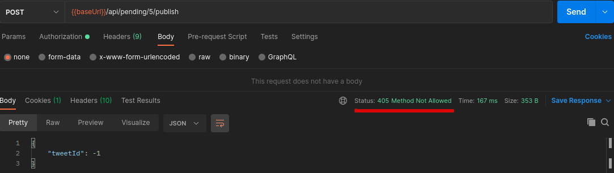

# Feature: publish on demand

- [Feature requisites](#feature-requisites)
- [How feature is implemented](#how-feature-is-implemented)
- [Implementation steps](#implementation-steps)
- [Commits](#commits)

---

## Feature requisites

Is requested to provide a way to publish immediatly created Pending Tweets on demand

## How feature is implemented

In order to complete this feature, is needed to modify the **domain** of the application, adding new value object to Tweet aggregate root:


This new attribute can have two different values:

- `ON_DEMAND`: If the publication of the tweet has been forced.
- `SCHEDULED`: If the publication of the tweet has been, when it was planned.

This also changes the **database** adding a new column to TWEET table:


To be able to publish on demand a pending tweet, a new endpoint is added to REST API:


## Implementation steps

Following steps has been achieved to implement current feature:

- [Add new feature toggle disabled](#add-new-feature-toggle-disabled)
- [Add V2 flyway script](#add-v2-flyway-script)
- [Add REST endpoint to controller but returning 405 and hide it from OpenApi documentation](#add-rest-endpoint-to-controller-but-returning-405-and-hide-it-from-openapi-documentation)
- [Add publicationType to JPA Tweet entity](#add-publicationtype-to-jpa-tweet-entity)
- [Add publicationType to domain and adapt current implementation](#add-publicationtype-to-domain-and-adapt-current-implementation)
- [Add PublishPendingTweetOnDemand useCase definition](#add-publishpendingtweetondemand-usecase-definition)
- [Add PublishPendingTweetOnDemand service implementation](#add-publishpendingtweetondemand-service-implementation)
- [Add publicationType to controller](#add-publicationtype-to-controller)
- [Enable feature toggle](#enable-feature-toggle)
- [Show method in OpenApi](#show-method-in-openapi)
- [Remove feature toggle](#remove-feature-toggle)

### Add new feature toggle disabled

On `Features.java` add new feature toggle:

```
	@Label("Publish on demand")
	PUBLISH_ON_DEMAND
```

It is disabled by default


### Add V2 flyway script

Include script `V2__add_publication_type.sql` with new column and setting default value as `SCHEDULED`

```
ALTER TABLE TWEET
ADD PUBLICATION_TYPE varchar(255) DEFAULT 'SCHEDULED' NOT NULL
```

### Add REST endpoint to controller but returning 405 and hide it from OpenApi documentation

As it is described [here](https://www.baeldung.com/spring-swagger-hiding-endpoints#hiding-an-endpoint-with-hidden), any REST method can be hidden using `@Hidden` annotation when OpenApi v3 is used:

```
	@Hidden
	@Operation(
			summary = "Publish a pending tweet immediately", 
			description = "Publish a pending tweet immediately", 
			tags = { "pending" })
    @ApiResponses(value = { 
        @ApiResponse(responseCode = "200", description = "pending tweet successfully published",
                content = @Content(schema = @Schema(implementation = PublishOnDemandResponse.class))),
        @ApiResponse(responseCode = "404", description = "pending tweet not found"),
        @ApiResponse(responseCode = "405", description = "Feature in progress") })
	public ResponseEntity<PublishOnDemandResponse> publishOnDemand(@PathVariable Long id);
```

But method is reachable as it is shown:



Tests added:

- Mapper: PublishOnDemandResponseMapperTest (unitary)
- Controller: check that 405 is returned as httpStatus
    - PendingApiControllerTest.publishOnDemandPendingTweetTest() (unitary)
    - PendingApiControllerIT.publishOnDemandPendingTweetTest() (integration)

### Add publicationType to JPA Tweet entity

Publication type has two possible values: SCHEDULED and ON_DEMAND, so best choice to model it is using an enum that later will be used in domain:

```
public enum PublicationType implements ValueObject {

	SCHEDULED,
	ON_DEMAND
}
```

As it is described [here](https://www.baeldung.com/jpa-persisting-enums-in-jpa#string) in order to use this enum in JPA:

```
	@Enumerated(EnumType.STRING)
	private PublicationType publicationType;
```

### Add publicationType to domain and adapt current implementation

Add new attribute in Tweet class:

```
private PublicationType publicationType;
```

Set SCHEDULED value when service needs to persist new Tweet:

- PublisherService.publishPending

```
				tweetPort.create(Tweet.builder()
						.id(published.getId())
						.message(published.getMessage())
						.url(published.getUrl())
						.requestedPublicationDate(pending.publicationDate().instant())
						.publishedAt(published.getPublishedAt())
						.createdAt(NullableInstant.now().instant())
						.publicationType(PublicationType.SCHEDULED)
						.build());	
```

Adapt unitary tests TweetTest in order to take this change in account

Add publicationType to TweetResponse as attribute and also to TweetResponseMapper:

```
	private String mapPublicationType(final Tweet request) {
		
		return request.publicationType().name();
	}
```

### Add PublishPendingTweetOnDemand useCase definition

```
public interface PublishPendingTweetOnDemandUseCase {

	public Optional<Tweet> publishImmediatly(PublishPendingTweetOnDemandOperation operation);
}
```

### Add PublishPendingTweetOnDemand service implementation

Implement service in PublisherService

```
	@Override
	public Optional<Tweet> publishImmediatly(PublishPendingTweetOnDemandOperation operation) {

		final var pending = pendingTweetPort.findOne(operation.getId());

		if (pending.isPresent()) {

			logger.info("Found pending tweet with id = " + pending.get().id() + " to publish on demand");
			final var publishedTweet = twitterService.publish(PublishTweetRequest.builder()
					.message(pending.get().message().message())
					.build());

			logger.info("Successful on demand publication for pending tweet with id = " + pending.get().id().id());
			if (publishedTweet.isPresent()) {

				pendingTweetPort.delete(pending.get().id().id());

				final var tweet = tweetPort.create(Tweet.builder()
						.id(publishedTweet.get().getId())
						.message(publishedTweet.get().getMessage())
						.url(publishedTweet.get().getUrl())
						.requestedPublicationDate(pending.get().publicationDate().instant())
						.publishedAt(publishedTweet.get().getPublishedAt())
						.createdAt(NullableInstant.now().instant())
						.publicationType(PublicationType.ON_DEMAND)
						.build());

				return Optional.of(tweet);
			}		
		}
		return Optional.empty();
	}
```

### Add publicationType to controller

Controller implementation:

```
	@PostMapping("/{id}/publish")
	public ResponseEntity<PublishOnDemandResponse> publishOnDemand(Long id) {
		
		if (!featureManager.isActive(Features.PUBLISH_ON_DEMAND)) {
			logger.info("Publish on demand feature is disabled");
			return new ResponseEntity<>(null, HttpStatus.METHOD_NOT_ALLOWED);
		}
		else {
			
			final var operation = publishPendingTweetOnDemandRequestMapper.mapRequest(id);
			
			final var useCaseResponse = publishPendingTweetOnDemandUseCase
					.publishImmediatly(operation);
			
			if (useCaseResponse.isPresent()) {
				return new ResponseEntity<>(publishOnDemandResponseMapper
						.mapResponse(useCaseResponse.get()), HttpStatus.OK);
			} else {
				return new ResponseEntity<>(null, HttpStatus.NOT_FOUND);
			}
		}
	}
```


Unitary tests:

```
@Test
	@DisplayName("Publish on demand pending tweet when feature active and pending doesn't exist, expect not found")
	void publishOnDemandNotExistingPendingTweetWhenFeatureActiveTest() throws Exception {

		when(featureManager.isActive(Mockito.any()))
			.thenReturn(true);
		
		when(publishPendingTweetOnDemandUseCase.publishImmediatly(any()))
			.thenReturn(Optional.empty());

		mvc.perform(
				post("/api/pending/" + pendingTweet.id().id() + "/publish")
				.contentType(MediaType.APPLICATION_JSON))
		.andExpect(status().isNotFound());
	}
	
	@Test
	@DisplayName("Publish on demand pending tweet when feature active and pending exist, expect OK")
	void publishOnDemandExistingPendingTweetWhenFeatureActiveTest() throws Exception {

		when(featureManager.isActive(Mockito.any()))
			.thenReturn(true);
		
		when(publishPendingTweetOnDemandUseCase.publishImmediatly(any()))
			.thenReturn(Optional.of(onDemandTweet));

		mvc.perform(
				post("/api/pending/" + pendingTweet.id().id() + "/publish")
				.contentType(MediaType.APPLICATION_JSON))
		.andExpect(status().isOk())
		.andExpect(jsonPath("$.tweetId", equalTo(Math.toIntExact(onDemandTweet.id().id()))));
	}
```
### Enable feature toggle

In Features enum, include @EnabledByDefault annotation for PUBLISH_ON_DEMAND feature:

```
	@EnabledByDefault
	@Label("Publish on demand")
	PUBLISH_ON_DEMAND
```


Delete IT that check that publishOnDemand return 405 httpCode

### Show method in OpenApi

Remove `@Hidden` annotation from REST endpoint:

```
	@Operation(
			summary = "Publish a pending tweet immediately", 
			description = "Publish a pending tweet immediately", 
			tags = { "pending" })
    @ApiResponses(value = { 
        @ApiResponse(responseCode = "200", description = "pending tweet successfully published",
                content = @Content(schema = @Schema(implementation = PublishOnDemandResponse.class))),
        @ApiResponse(responseCode = "404", description = "pending tweet not found"),
        @ApiResponse(responseCode = "405", description = "Feature in progress") })
	public ResponseEntity<PublishOnDemandResponse> publishOnDemand(@PathVariable Long id);
```

Tests:
 - to enable/disable (405 code when feature toggle disabled)
 - try to publish an not existing pending tweet id (404)
 - try to publish an existing pending tweet id (200)

### Remove feature toggle

- Remove PUBLISH_ON_DEMAND feature toggle in Features enum
- Remove check feature toggle in pendingApiController
- Remove featureManager attribute in pendingApiController
- Remove featureManager attribute in pendingApiControllerTest

## Commits

As it is shown, per each commit in `main` branch, a new deployment in heroku has been done:

