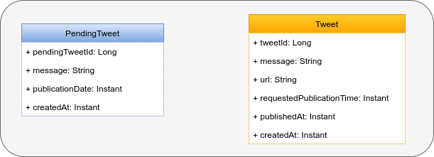
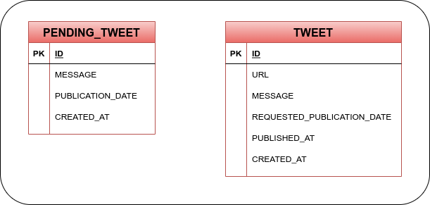
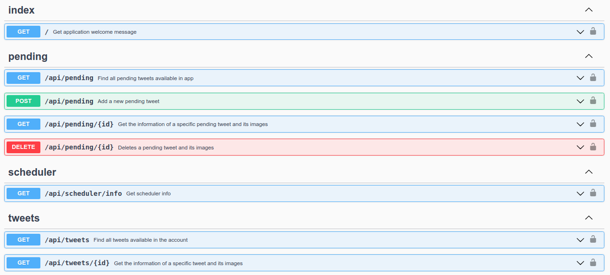

# Initial implementation

- [Domain](#domain)
- [Database](#database)
- [REST API](#rest-api)

---

## Domain

## Database

## REST API

[OpenAPI specification](https://swagger.io/specification/) has been used to document provided REST API:

